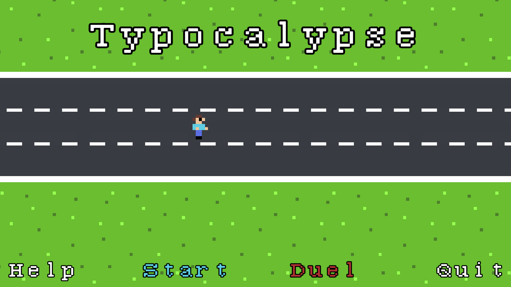
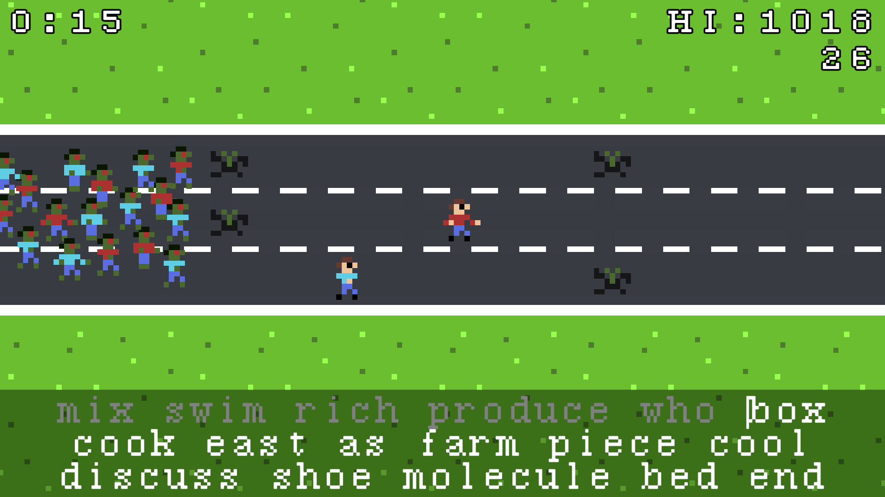
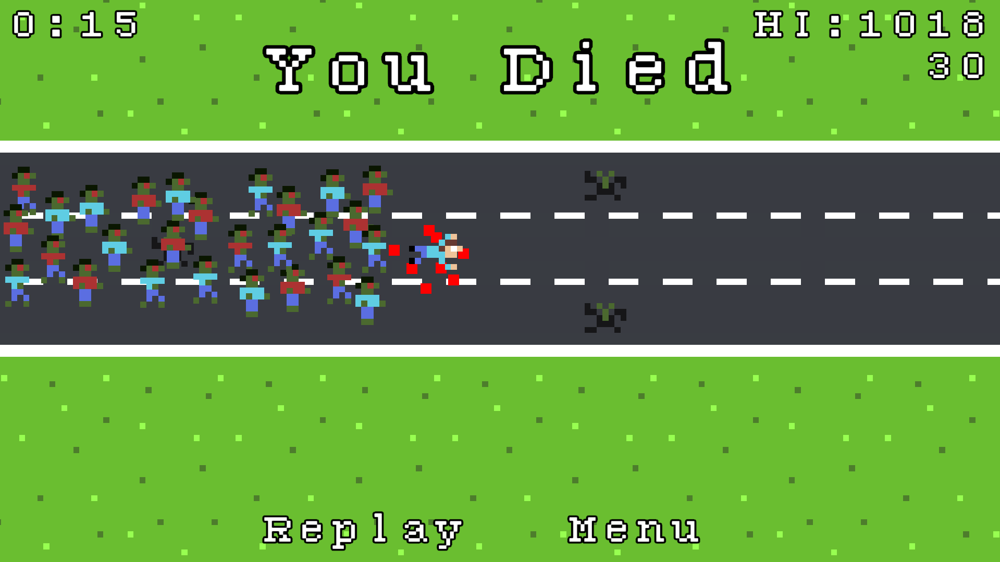

# Typocalypse

### An endless runner where your typing speed is your only hope for survival...  
Escape a relentless zombie horde and navigate through zombie hands reaching from underground by typing the words that appear on screen!

  

## Features
* **Typing-Driven Movement**: Every step is performed by a keypress; type fast to stay ahead of the horde
* **Local Data Persistence**: High scores are saved locally to ensure progress is tracked between play sessions
* **Online Multiplayer**: Compete with friends online to see who can survive the longest
* **Cross-Platform Support**: Optimized builds for Windows, macOS, Linux, and WebGL  

## Gallery

  
   <b>Main Menu</b> 

  
   <b>Gameplay (Duel)</b> 

  
   <b>Death Screen</b> 

## Technical Stack
* **Game Engine**: Unity
* **Language**: C#

## Development Insights
The aim of this project was to create a game that could help players build a tangible skill (typing) in an enjoyable way, all while improving my programming and game development abilities. I have created a few games before so I had a bit of experience going into this. All code, sound effects and art were created by me, using VS Code, jsfxr and LibreSprite respectively. During the development process, I gained significant experience in networking, specifically regarding the client-server model, state synchronization, and navigating network security protocols like firewalls and IP management. Additionally, I implemented local data persistence to securely store player progress and high scores on the user's device. I'm quite happy with how it turned out: I don't plan on adding updates although I may do, and I look forward to applying what I learnt in the future.
